<!-- Profile Header -->

  

  

  
  
  
  

---

## About Me

I am an Indonesian software developer currently studying at **Sebelas Maret University**.  
I focus on building practical software across web development, mobile development, and machine learning.

- Currently working on **Neo Edukasi**
- Interested in **Software Development**, **Data**, and **Machine Learning**
- Currently learning **Astro**, **Next.js**, **React**, **Flutter**, **Kotlin**, **Laravel**, and **Vue.js**
- Reach me at **ridloabdullahulinnuha543@gmail.com**
- Outside coding, I enjoy grinding games and improving systems step by step
- Portfolio: [ridlo-portfolio-profile.vercel.app](https://ridlo-portfolio-profile.vercel.app)

---

## Tech Stack

### Frontend

  
  
  
  
  
  
  
  
  
  

### Backend

  
  
  
  
  
  

### Mobile

  
  
  
  

### Data & Machine Learning

  
  
  
  
  
  
  
  

### Database, DevOps & Tools

  
  
  
  
  
  
  
  
  
  

---

## GitHub Overview

  

<!--
## GitHub Analytics

  
  

  

> Note: GitHub stats cards are generated by third-party public services. If they fail to load, the service may be rate-limited or temporarily unavailable.

---

## GitHub Trophies

  

-->
---

## Contribution Activity

  

---

  

